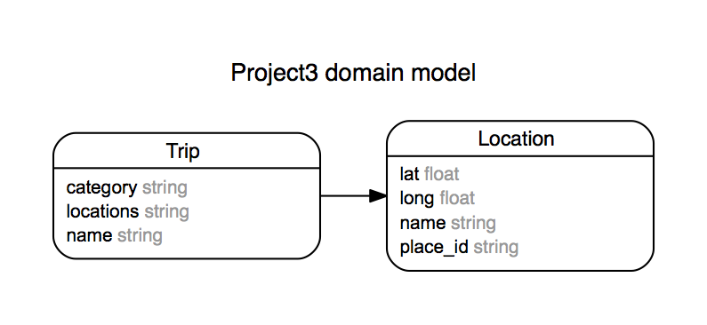

# Auto Pilot

Auto Pilot is a web application designed to allow users to create trips containing locations through the Google Places API and display the route on a map.

## Group Members
- Keith Prifte
- Sanjaya Satyal
- Caitlin Daitch

## Installation Instructions
- Fork and clone this repo
- Bundle Install
- Create database, migrate, seed
- Get an API key for Google Places
- Install Figaro Gem

## Technologies Used
- AngularJS
- Third-party API integration
  - Google Places
  - Google Maps
- Ruby on Rails
- HTML/CSS/Sass

## User Stories
- As a user, I can search for existing trips by city and category
- As a user, I can create a new trip containing multiple establishments
- As a user, I can add an establishment to my trip based on name and city
- As a user, I want to see Instagram posts for each establishment on my trip
- As a user, I will see a map that pinpoints all establishment locations

<!--
This README would normally document whatever steps are necessary to get the
application up and running.

Things you may want to cover:

* Ruby version

* System dependencies

* Configuration

* Database creation

* Database initialization

* How to run the test suite

* Services (job queues, cache servers, search engines, etc.)

* Deployment instructions

* ...

Please feel free to use a different markup language if you do not plan to run
<tt>rake doc:app</tt>. -->
